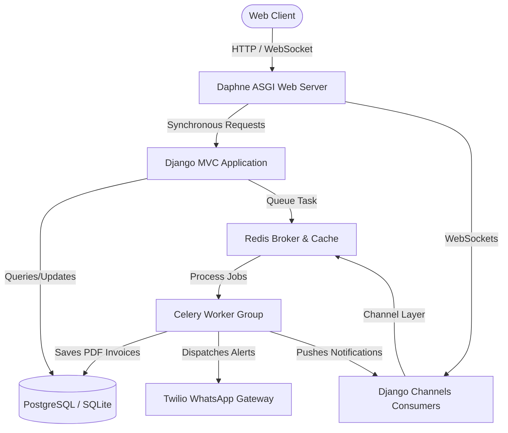

# SmartSpend: AI-Powered Personal & Team Financial Copilot

**SmartSpend** is a production-ready, feature-rich, full-stack B2C and B2B SaaS personal finance and team expense management application. Built using Python, Django, Channels (WebSockets), Celery, and Docker, the platform goes beyond standard ledger systems by embedding AI-driven heuristics, real-time messaging, asynchronous report generation, multi-tenant B2B collaboration workflows, and an e-commerce ecosystem.

---

## 🚀 Key Highlights & Tech Stack

- **Backend**: Django, Daphne (ASGI Server), Django Channels (WebSockets), REST APIs
- **Task Queue & Caching**: Celery (Distributed Task Queue) with Redis (Message Broker & Cache)
- **Database**: PostgreSQL (Production) / SQLite (Development) with Django ORM
- **Frontend**: Django Templates, JavaScript (AJAX, Websocket Clients, Chart.js for interactive analytics)
- **AI & NLP**: Voice-to-transaction parsing, SMS bank transaction parsing, statistical Linear Regression spending forecasting, and AI Savings Advisor
- **DevOps & Containerization**: Multi-container Docker & Docker Compose setup (PostgreSQL, Redis, Daphne Web Server, Celery Worker)
- **Security & Privacy**: Multi-Factor Authentication (MFA), active device session tracking and revocation, GDPR compliance utilities, and developer API key management

---

## 🛠️ Detailed Feature Breakdown

### 1. 🧠 Intelligent Financial AI Heuristics
*   **Natural Language Transaction Parsing**: Users can type standard sentences (e.g., *"spent 450 on food for dinner"*), and the system's regex-based NLP engine auto-extracts the amount, matches the category (Food), and populates a descriptive note.
*   **Voice Assistant**: A microphone interface on the dashboard that records audio inputs and processes them via NLP to automatically register transactions.
*   **SMS Bank Parser**: Automatically parses financial alerts from mobile carriers and wallets (Google Pay, PhonePe, Netbanking, Credit/Debit cards), extracting amounts, payment modes, and merchants to eliminate manual logging.
*   **AI Spending Forecasting**: An asynchronous Celery task runs a **linear regression model** over historical spending data to project a user's total expenditure by the end of the next month.
*   **AI Savings Advisor**: Projects savings over 1, 5, and 10 years at a compounded 7% growth rate based on 20% of their historical monthly expenses.

### 2. 🏢 B2B Multi-Tenant Team Management
*   **Hierarchical Structures**: Support for Organizations, Teams, and Memberships.
*   **Role-Based Access Control (RBAC)**: Defined roles (Admin, Moderator, Member) that control specific operations.
*   **Team Budgets & Approvals**: Separate shared budgets for team goals. Members can submit business-related expenses, which are then passed through manager approval/rejection workflows.

### 3. 💳 Monetization & SaaS Billing
*   **Premium Tiers**: Dynamic subscription engine (Standard vs. Premium plans) with active subscription status validation.
*   **Coupons & Checkout**: Client-side coupon validation API that computes discounts dynamically before checkout.
*   **Automated Billing**: High-fidelity PDF tax invoice generation dynamically built using **ReportLab** during background Celery tasks.

### 4. 🔒 Enterprise Security & GDPR Controls
*   **MFA via OTP**: Opt-in 6-digit One-Time Password verification on login.
*   **Device Session Management**: Track user logins with device metadata and IP addresses. Users can revoke active sessions on external devices instantly.
*   **Security & Audit Logging**: Track structural changes, failed logins, and administrative operations.
*   **GDPR Compliance**: Single-click interface allowing users to **Export Data** (complete JSON backup of their profile, expenses, and settings) or **Purge Account** (permanently delete all database records).

### 5. 👥 Community & Gamification
*   **Savings Challenges**: Users can join and track specific goals (e.g., *"Save 10,000 for vacation"*), tracking progress milestones.
*   **Social Finance Forums**: A built-in discussion forum supporting post creation, nested commenting, upvoting, bookmarks, and reporting to encourage collaborative financial literacy.
*   **Affiliate Portal**: Curated financial product marketplace (loans, credit cards) with redirection logic and conversion tracking.

### 6. 🔌 Developer Portal
*   **Developer API Keys**: Self-serve API key generation and revocation for developers looking to integrate third-party applications with the SmartSpend API.
*   **Prometheus Metrics Endpoint**: System monitoring endpoint exposed to collect application performance statistics.

---

## 📐 System Architecture & Design Pattern

The application utilizes a distributed, service-oriented architecture containerized with Docker to ensure scalability:



- **ASGI Daphne Server** handles standard HTTP requests alongside asynchronous WebSockets (Django Channels).
- **Redis** operates as a transient state manager for WebSocket channel groups and serves as the message broker for **Celery**.
- **Celery Workers** manage CPU-intensive, long-running processes (PDF invoice generation, linear regression modeling, CSV/Excel report exports, email dispatching, database backups).

---

## 🗄️ Database Schema highlights (35+ Django Models)

The backend database contains a robust relational schema structured for transactional integrity:
- **Core Entities**: `User`, `Profile`, `Expense`, `Budget`
- **Session Trackers**: `UserDeviceSession`, `AuditLog`
- **Security & APIs**: `DeveloperApiKey`, `FeatureFlag`
- **Monetization & E-commerce**: `Subscription`, `SubscriptionPayment`, `SubscriptionInvoice`, `Coupon`, `MarketplaceProduct`, `MarketplaceOrder`, `Vendor`
- **Team B2B Entities**: `Team`, `TeamMembership`, `TeamExpenseApproval`, `Organization`, `TeamInvitation`, `TeamBudget`
- **Social Ecosystem**: `ForumPost`, `ForumComment`, `ForumPostLike`, `ForumPostBookmark`, `ForumPostReport`

---

## 💡 Key Engineering Challenges & Solutions

### Challenge 1: Avoid Blocking Request Threads for Long-Running Operations
*   **Problem**: Exporting large financial records (CSV/Excel) or generating custom PDFs via ReportLab would freeze the client connection, leading to a poor user experience or request timeouts.
*   **Solution**: Offloaded execution to a background **Celery task worker**. The client requests a report, which instantly returns a "Processing" status. Once Celery completes the export, it saves the file to storage, creates a `Notification` object, and fires a WebSocket broadcast to the user's browser, enabling real-time, non-blocking downloads.

### Challenge 2: Parsing Messy natural SMS formats accurately
*   **Problem**: Bank transaction SMS formats are highly inconsistent, differing by region, bank, and transaction type (UPI, Debit, Credit Card).
*   **Solution**: Implemented a layered **Regex & Dictionary matching engine** inside `nlp.py`. It first runs regex patterns to locate transaction amounts, sanitizes currency markers, matches categories based on a prioritized dictionary of keywords, and uses boundary checks to strip transaction IDs and locate the merchant name.

### Challenge 3: Real-Time Event Dispatching without heavy polling
*   **Problem**: Multi-device sessions need instant updates (e.g. revoking a session from another device should terminate the target connection immediately).
*   **Solution**: Configured **Django Channels** to map each user to a unique WebSocket channel group `user_{user_id}`. When a session is revoked or a critical notification is dispatched, a message is published to the channel group, forcing the target device to close its socket connection and redirect to the logout page.

---

## 🛠️ How to Run Locally

### 🐳 Using Docker (Recommended)
1. Ensure Docker and Docker Compose are installed.
2. Build and run the containers:
   ```bash
   docker-compose up --build
   ```
3. Run migrations and create a superuser inside the web container:
   ```bash
   docker-compose exec web python manage.py migrate
   docker-compose exec web python manage.py createsuperuser
   ```
4. Access the app at `http://localhost:8000`.

### 🐍 Standard Local Setup
1. Create a Python virtual environment and activate it:
   ```bash
   python -m venv .venv
   # Windows:
   .venv\Scripts\activate
   ```
2. Install dependencies:
   ```bash
   pip install -r requirements.txt
   ```
3. Run the development server:
   ```bash
   python manage.py migrate
   python manage.py runserver
   ```
